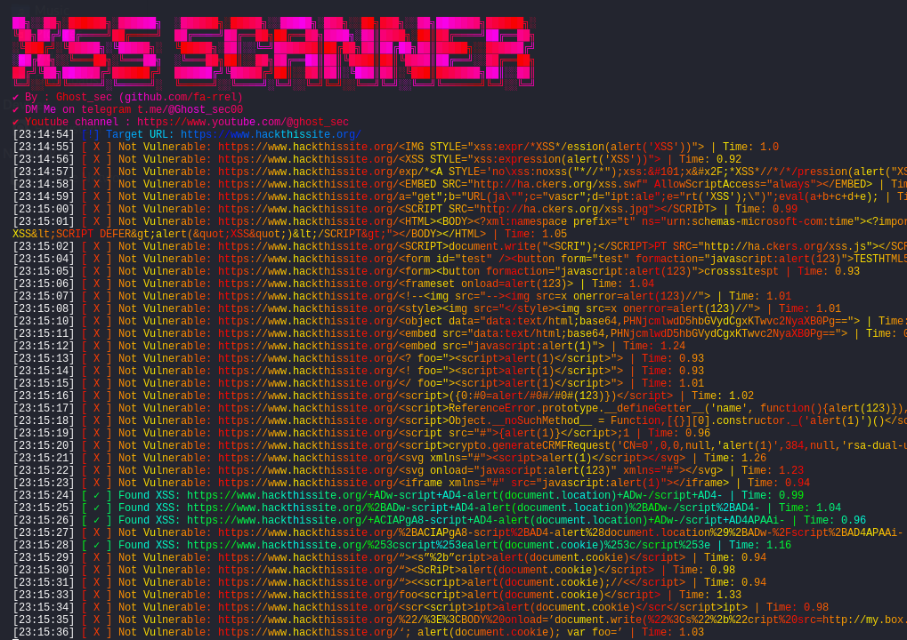

# XSS Scanner with multiple payloads
Scanning any site with xss vulnerability xD


### Install the script requirements:
```sh
pip install pystyle
```

### Single Target:
```sh
python3 xss_scanner.py --url {https://www.hackthissite.org/} -p {payloads1.txt}
```

## Disclaimer
#WARNING!!!
This tool is provided for educational and research purposes only. The creator assumes no responsibility for any misuse or damage caused by the tool. 
